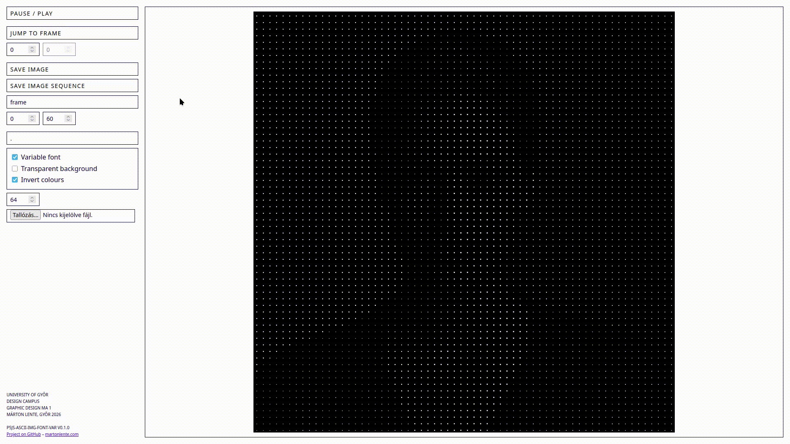
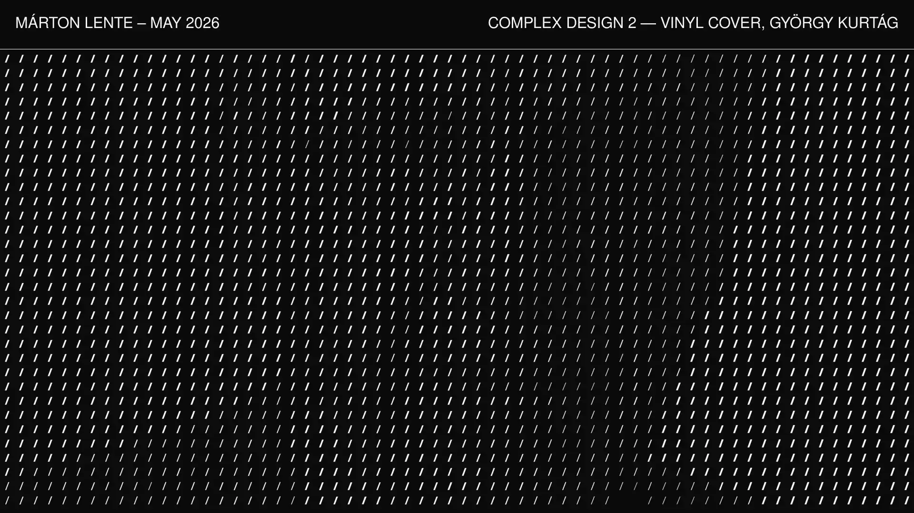
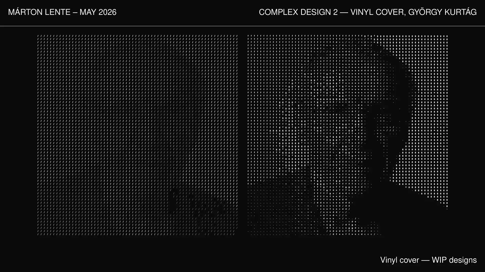
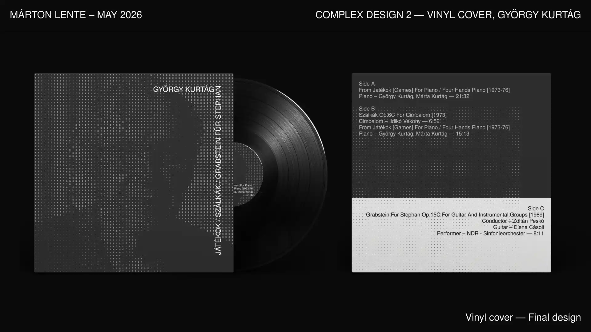
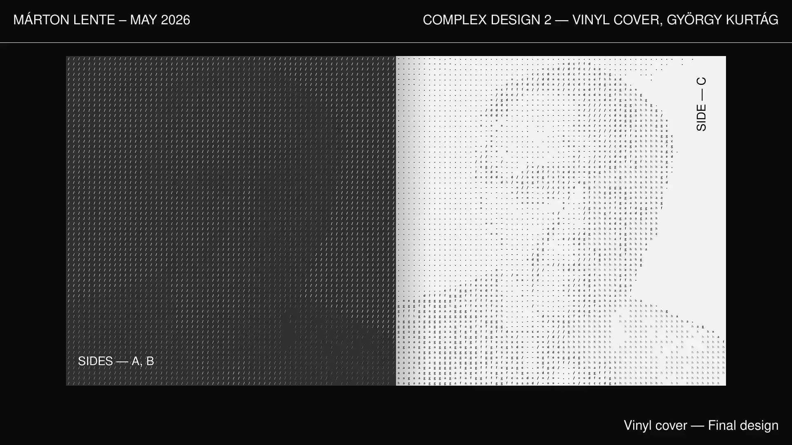
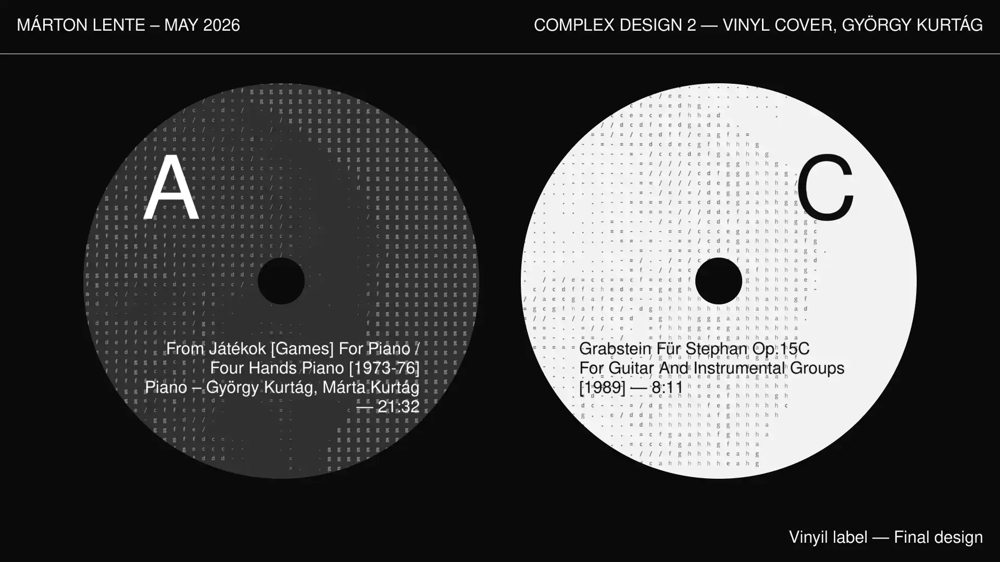

# p5js-ascii-img-font-var

p5js-ascii-img-font-var is a tool for generating ASCII art from images with simple UI controls and variable font support. Unlike traditional ASCII art tools, this project leverages variable font weights for enhanced visual output.

This repository has been created from the [p5js-sketch-utils](https://github.com/martonlente/p5js-sketch-utils) boilerplate and utilties framework by [Márton Lente](https://github.com/martonlente) (me).

## Demo


## Description
I've created this repository to support ASCII based image rasterization in art, design and typography projects, with visual controls. It relies on p5.js v2's variable font support to create ASCII images with variablility in font weight. This allows a combination of character- and font weight based rasterization, and enables finer control over contrast and detail in the final image. This often results in more interesting visual outputs than traditional solely character-based ASCII art.

## Usage

### Start a project
To start using the repository, clone it.

### Initialize and install dependencies
To initialize and update the git submodules, run:

```
git submodule init
git submodule update
```

To install the dependencies, navigate to the project directory and run:

```
npm install
```

### Start the dev server
To start the development server to view and edit your sketches, run:

```
npm run-script serve
```

This will launch a local server, and you can access the controls UI and sketch in your browser at the returned URL. The sketch is automatically reloaded on change.

#### Change sketch canvas size
To change the sketch canvas size, use the bundled `p5jsSetupCanvas` function utility:
```
p5jsSetupCanvas(p, {pxWidth}, {pxHeight}, {true});
```

Example:
```
p5jsSetupCanvas(p, 1024, 1024);
```

### Customize and extend controls and utilities
Add new controls or extend the utilities UI by extending the `sketch.js` file in the `js` directory. Ensure that your changes align with the existing architecture and modular design.

### Customize styles
If you want to customize the styles of the controls UI, run:
```
npm run-script watch
```
to start the SCSS compiler, and add your changes to the `/scss/custom.scss` file.

## Dependencies
This project requires Node.js and npm to be installed on your machine.

## Example

 | &nbsp;
--- | ---
 | 
 | 

## Version
0.1.0

## Credits
I've started this project at the _University of Győr, [Design Campus](https://designcampus.hu), Graphic Design MA_ in 2026.

The development has been done within the framework of the _Complex Design 2_ course, lead by [Zoltán Halasi](https://www.instagram.com/zedocki/). The program has been first used to generate the vinyl cover artworks for the Hungarian composer _György Kurtág's_ fictitious music album compilation (see the _Example_ section for reference).

## License
p5js-ascii-img-font-var is licensed under the [Apache 2.0](https://github.com/martonlente/p5js-ascii-img-font-var/blob/main/LICENSE) license.
