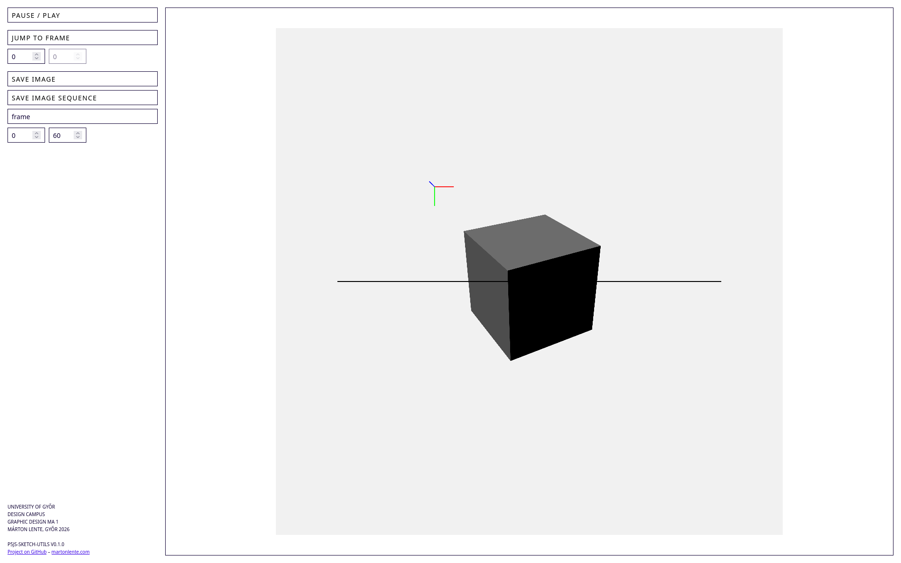

# p5js-sketch-utils

p5js-sketch-utils is a boilerplate and utilities framework that streamlines p5.js projects with tools that help exporting, navigating and organizing sketches.

## Description
I've created this repository as a starting point and utility framework to support local development of new p5.js projects, with common tools for exporting, navigating and organizing sketches in the browser. The project is a local alternative to interactive editors, like the [p5.js Web Editor](https://editor.p5js.org/). It includes a simple UI with canvas, playback control, single image and image sequence export, and a framework to add and manage custom sketches. New sketches can add controls in a modular way, extending the UI seamlessly.

## Usage

### Start a project
To start using the framework, clone this repository.

### Initialize and install dependencies
To initialize and update the git submodules, run:

```
git submodule init
git submodule update
```

To install the dependencies, navigate to the project directory and run:

```
npm install
```

### Start the dev server
To start the development server to view and edit your sketches, run:

```
npm run-script serve
```

This will launch a local server, and you can access the controls UI and sketches in your browser at the returned URL. Sketches are automatically reloaded on change.

### Add a new sketch
To add a new sketch, create a new JavaScript file in the `sketches` directory. Use the existing `sketch.js` file as an example reference for functionality and structure.

#### Setup sketch canvas
To setup the sketch canvas, use the bundled `p5jsSetupCanvas` function utility:
```
p5jsSetupCanvas(p, {pxWidth}, {pxHeight}, {true});
```

Pass in `true` to enable WebGL rendering for 3D sketches.

Example:
```
p5jsSetupCanvas(p, 1080, 1080, true);
```

### Render the new sketch
To render the new sketch, call an URL with the following format scheme: `http://localhost:3000/?js={sketch-custom}.js`

You can add as many new sketches as you want, and render them independently.

### Customize and extend controls and utilities
Add new controls or extend the utilities UI by extending sketch files in the `js` directory. Ensure that your changes align with the existing architecture and modular design.

TODO: add more details

### Customize styles
If you want to customize the styles of the controls UI, run:
```
npm run-script watch
```
to start the SCSS compiler, and add your changes to the `/scss/custom.scss` file.

## Dependencies
This project requires Node.js and npm to be installed on your machine.

## Screenshot


## Version
1.0.0-alpha

## Credits
I've started this project at the _University of Győr, [Design Campus](https://designcampus.hu), Graphic Design MA_ in 2026.

## License
p5js-sketch-utils is licensed under the [Apache 2.0](https://github.com/martonlente/p5js-sketch-utils/blob/main/LICENSE) license.
